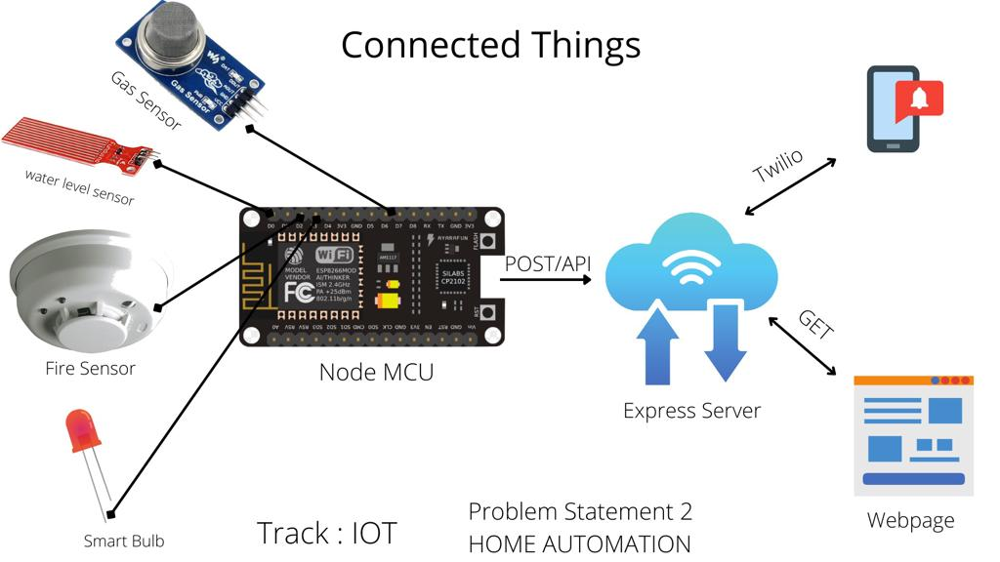

# Connected Things

[click here to enter Connected things](https://connected-things.herokuapp.com/)
[Here is hardware program ](https://github.com/chethancm2001/postdata)

A State-of-the-Art Web based service to interact with sensors planted in home and to react to them in real-time

## Inspiration
IoT peripheral devices like Sensors are great for collecting data but when it comes to Processing the data and making decisions based on it, we run into serious processing issues due to lack of Compute power on these tiny little things. To overcome this problem we take the processing load from the Sensors to Cloud.

## What it does
Connected Things recieves data from the Sensors when certain threshold condition is breached. This data is used to make decisions or to run pre-defined statements 

## How we built it

The Tech Stack we chose to tackle this problem consists of HTML, CSS, Bootstrap for the frontend, Node JS, Express JS for the backend, MongoDB to handle the Document Storage and Retrieval, esp8266 (Node MCU) is used to collect the sensor data and post it to express server

## Challenges we ran into
The main challenge we went through was connecting hardware to the server. We use http protocal to do this 

## Accomplishments that we're proud of 
Firstly this is our first hackthon and We are proud of it!

## What we learned
Learnt to work with team, dividing the work 

## What's next for connected things
We are planing to work on real-time database 
